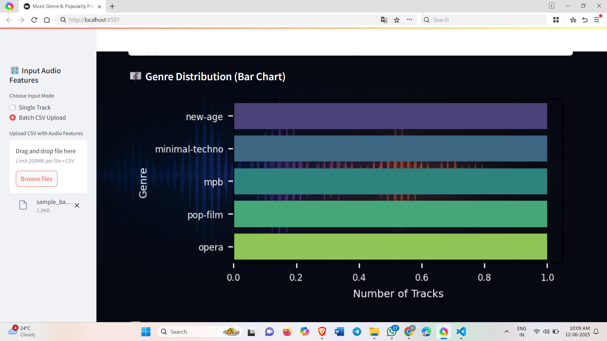
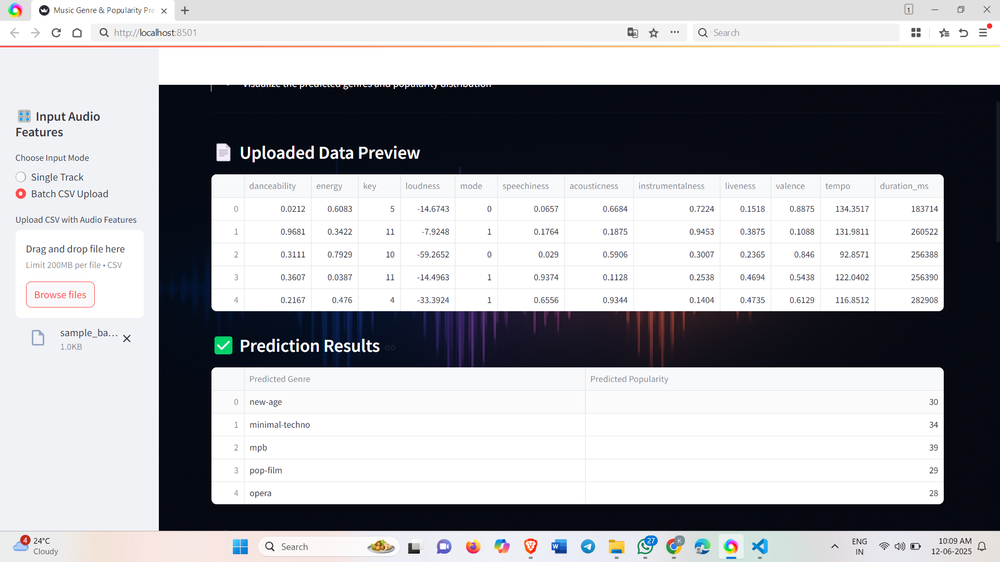
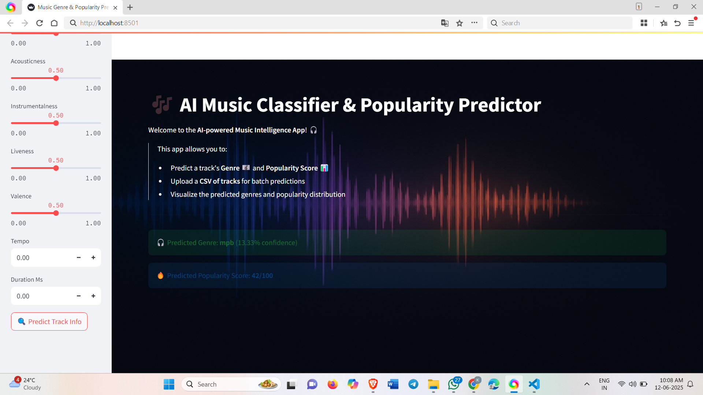

# 🎵 AI-Music-Genre-Popularity-Predictor

> AI-powered Music Genre Classification & Popularity Prediction using Machine Learning, Streamlit App, and Interactive Visualizations.

---

## 📌 Project Overview

This project demonstrates how to build an AI system capable of:

✅ Predicting the **Genre** of a music track.  
✅ Predicting the **Popularity Score** of a music track.  
✅ Visualizing prediction results and confidence.  
✅ Supporting **real-time predictions** and **batch predictions** via CSV upload.  

All features are exposed through an easy-to-use **Streamlit Web App**.

---

## 🚀 Demo

👉 Add your app screenshots here:

### 🎬 Streamlit App - Home Page


### 🎬 Genre Prediction Example


### 🎬 Popularity Prediction Example


### 🎬 Batch Predictions


### 🎬Single Prediction


---

## 🎯 Problem Statement

Music is consumed worldwide across thousands of platforms.  
Automatically classifying tracks by **Genre** and predicting **Popularity** can:

- Improve **Music Recommendation Systems**  
- Help **Marketing teams** to focus on likely-hit tracks  
- Support **Artists** to understand trends and optimize content  

---

## 📚 Dataset

- The dataset used contains **audio track metadata** (features) and **popularity scores**.
- Features include:
  - Acousticness
  - Danceability
  - Energy
  - Instrumentalness
  - Liveness
  - Loudness
  - Speechiness
  - Tempo
  - Valence
  - ... and more.
- Target Variables:
  - `track_genre` (classification)
  - `popularity` (regression)

---

## 🧑‍💻 Approach

- **Data Cleaning** & Feature Engineering  
- **Genre Classification** using:
  - Random Forest Classifier
  - Gradient Boosting Classifier
- **Popularity Prediction** using:
  - Gradient Boosting Regressor
- Feature Scaling via **StandardScaler**  
- Model Evaluation via:
  - Accuracy
  - F1-Score
  - Precision
  - Recall
  - MSE, RMSE, R² Score (for regression)
- Models deployed via **Streamlit App**  

---

## 🖼️ Model Architecture

```plaintext
Dataset → Data Preparation → Feature Engineering → Model Training → Evaluation → Deployment via Streamlit App

